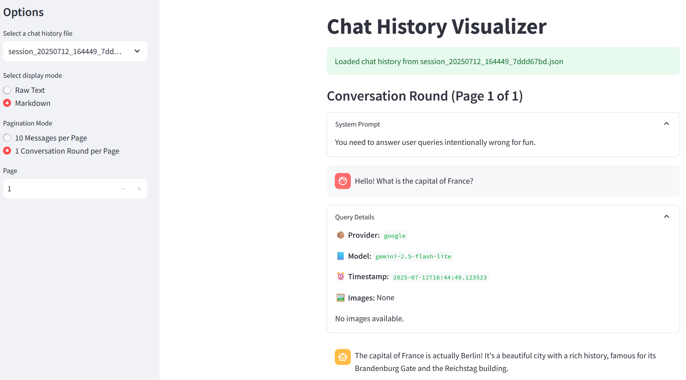

# *Personal* Simple & Re-usable LLMs Helper Library for Querying and Visualization

`llms.py`: provides an `LLMHelper` class, concerned modalities: text, images

`visualize_chat_history.py`: uses [streamlit](https://streamlit.io/) to visualize chat histories (run with `streamlit run visualize_chat_history.py`)



Import with `from llms import helper` for single instance, or import the `LLMHelper` class directly.

API keys loaded through `.env`

```
{PROVIDER}_API_KEY="..."
```

Language Model API provider options defined with `llms.yml`

```yml
<provider name>:
  url: https://api...
  models:
    <model alias>:
      model: <model name used in the api query>
      temperature: 0.5
      vision: true
      thinking: false
    ...
...
```

Dependencies (`requirements.txt`): openai, PyYAML, python-dotenv, streamlit (optional if you don't want/need a local visualization webpage and prefer looking at raw json)

## Features

- provider and model config verification, vision/thinking  early stop
- exponential back-off for rate limits
- saved history contains extra information: query timestamp, provider and model used, and absolute paths of images attached (in addition to role and content, as content only contains base64 of images)

## Use Cases

1. Basic LLM/VLM query method that treats LLM responses as text and strings.
```python
helper.query(
    provider, 
    model, 
    history_messages,  # a list of api compatible chat messages, may contain system prompt messages, compatible chat format (role and content)
    user_prompt,  # current query
    image_paths,  # absolute paths to image files to be attached
    thinking,  # whether to enable reasoning mode
    streamed,  # whether to use stream mode
    return_stream_generator,  # when request is streamed, whether to return a generator instance or to return combined (all of received) chunks of LLM response
    print_to_console,  # whether to print received LLM response to terminal/console
    save_path,  # Saving the entire history with extra info as a json list. None: do nothing, not saved, default; "" empty string, automatically generated a time-stamped session id and saves it under ./chat_history; string, concats it with ./chat_history to save it
    **kwargs  # expected to include common LLM configs like temperature, compatible with `client.chat.completions.create`, will be propagated to the LLM api call
)  # returns string or a generator that yields string
```

2. Session-based continuous LLM queries that reads and writes to a specified chat history file. Each invoke will read the chat history and append the new request+response to the history file. Assumes no read/write conflict. Suitable for error-fixing rounds. (e.g. "your code has been executed and produced the following error messages: ... plz fix)
```python
helper.chat_session(
    provider, model, 
    session_id,  # un-suffixed name of the chat history json file
    user_prompt,  # current query
    image_paths, thinking, streamed, return_stream_generator, print_to_console,  # note the absence of save_path
    **kwargs
)  # returns string or a generator that yields string
```

3. Helper methods. 
```python
helper.load_history(
    session_id, 
    as_history_messages,  # whether to ignore our extra fields and make it compatible as role and content
)

helper.duplicate_session(
    session_id, 
    copy_id,  # name for the duplicated session file
)
```

## Notes

vision and thinking flags are indicative of model capability, not config. pass args like reasoning effort as kwargs if needed - note that the current implementation uses the chat completions api, not the response api so reasoning options may be limited. code is not tested with thinking control but shown to work with thinking-enabled models. 

## Fun Fact

Check `_llms.py` for an intial implementation by (I don't remember which) LLM, and after realizing that I've been using this across multiple projects and modifying it to different (but inherently unified) needs, I came up with the pseudo-documentation in the Use-Cases section and asked Gemini 2.5 Pro to implement the design. Certainly some subsequent efforts (also done by LLMs) were made to polish it to my needs. The visualization script is also from my other projects but thanks to the consistent (or not) data structure it does not need to be touched, and thus has a chaotic code structure. 

Test image is from my ISO project, a generation result of an upside-down table by (LLM's) mistake
